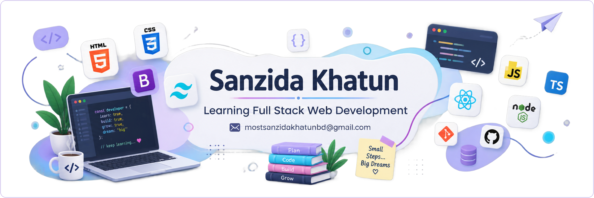

<!--  BANNER -->

  

<!--  INTRO -->

<h3><b>Hi, I'm Sanzida Khatun</b></h3>
<h5><i>Learning Full Stack Web Development</i></h5>

 

## About Me

I'm currently learning full stack web development, with a focus on building clean, responsive, and user-friendly websites. I learn best by building — so most of my time goes into small practice projects that push me to apply new concepts as I pick them up.

**Currently:**
- Deepening my JavaScript fundamentals
- Exploring React for building user interfaces
- Getting started with Node.js on the backend
- Working toward becoming a confident full stack developer
 

## Skills

<table>
<tr>
<td valign="top" width="40%">

**Frontend**
  

</td>
<td valign="top" width="30%">

**Exploring**
  

</td>
<td valign="top" width="30%">

**Tools**
  

</td>
</tr>
</table>
 

## GitHub Stats

  
  

  

 

## Connect With Me

 

  

